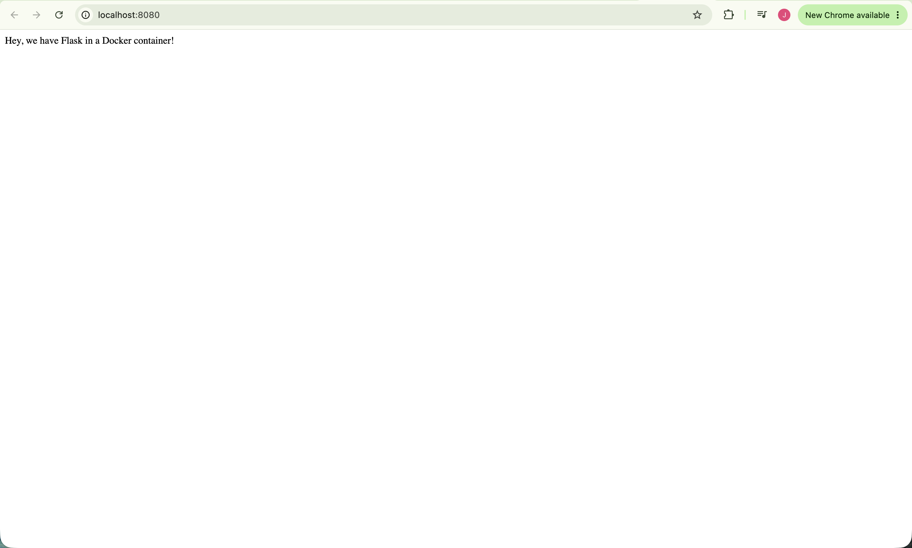

# Dockerized Flask App

A minimal Flask web app packaged in a Docker container, adapted from Runnable's (now archived) "Dockerize your Flask application" tutorial to run on Python 2.7. Getting it working required pinning Python-2-compatible dependency versions and fixing typos in the tutorial's code.

